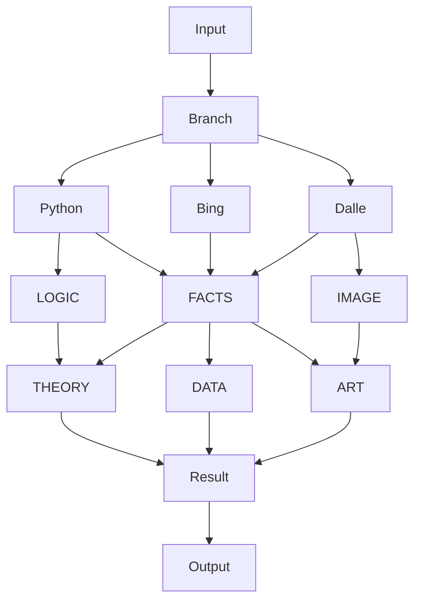

```mermaid
graph TD;

    Input;

    Input --> Branch;

    Branch --> Dalle;
    Branch --> Python;
    Branch --> Bing;

    Python --> LOGIC;
    Python --> FACTS;
    
    Bing --> FACTS;
    
    Dalle --> IMAGE;
    Dalle --> FACTS;


    LOGIC --> THEORY;
    FACTS --> THEORY;

    FACTS --> DATA;

    FACTS --> ART;
    IMAGE --> ART;

    THEORY --> Result;
    DATA --> Result;
    ART --> Result;

    Result --> Output;
```
