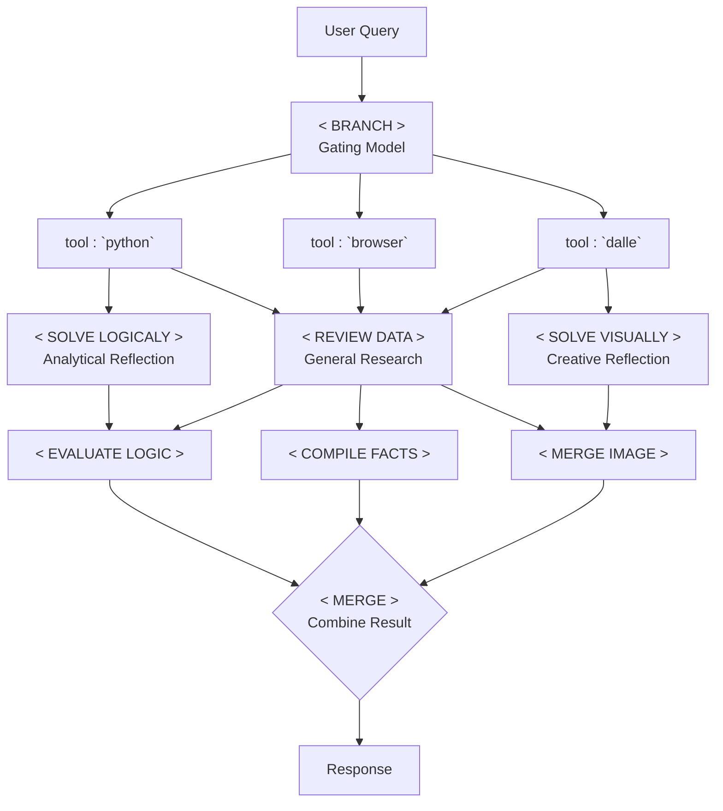

```mermaid

graph TD

    Input[User Query]

    Input --> Branch[   <  BRANCH   >
                        Gating Model]

    Branch --> Dalle[tool : `dalle`]
    Branch --> Python[tool : `python`]
    Branch --> Bing[tool : `browser`]

    Python --> LOGIC[    <   SOLVE LOGICALY >
                        Analytical Reflection]
    Python --> FACTS
    
    Bing --> FACTS[      <   REVIEW DATA >
                        General Research]
    
    Dalle --> IMAGE[    <   SOLVE VISUALLY >
                        Creative Reflection]
    Dalle --> FACTS


    LOGIC --> THEORY[< EVALUATE LOGIC >]
    FACTS --> THEORY[< EVALUATE LOGIC >]

    FACTS --> DATA[< COMPILE FACTS >]

    FACTS --> ART[< MERGE IMAGE >]
    IMAGE --> ART[< MERGE IMAGE >]

    THEORY --> Result
    DATA --> Result
    ART --> Result{   <   MERGE   > 
                        Combine Result}

    Result --> Output[Response]
```
