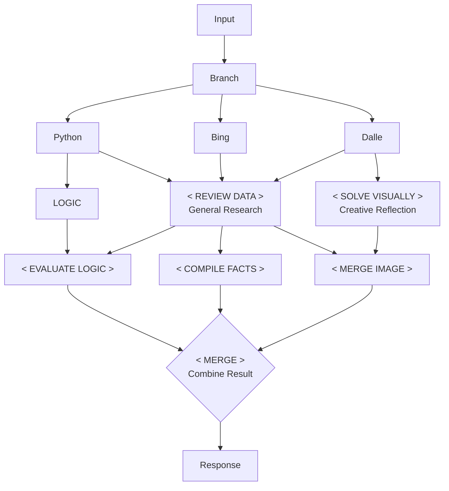

```mermaid
graph TD;

    Input;

    Input --> Branch;

    Branch --> Dalle;
    Branch --> Python;
    Branch --> Bing;

    Python --> LOGIC;
    Python --> FACTS;
    
    Bing --> FACTS[      <   REVIEW DATA >
                        General Research];
    
    Dalle --> IMAGE[    <   SOLVE VISUALLY >
                        Creative Reflection];
    Dalle --> FACTS;


    LOGIC --> THEORY[< EVALUATE LOGIC >];
    FACTS --> THEORY[< EVALUATE LOGIC >];

    FACTS --> DATA[< COMPILE FACTS >];

    FACTS --> ART[< MERGE IMAGE >];
    IMAGE --> ART[< MERGE IMAGE >];

    THEORY --> Result;
    DATA --> Result;
    ART --> Result{   <   MERGE   > 
                        Combine Result};

    Result --> Output[Response];
```
